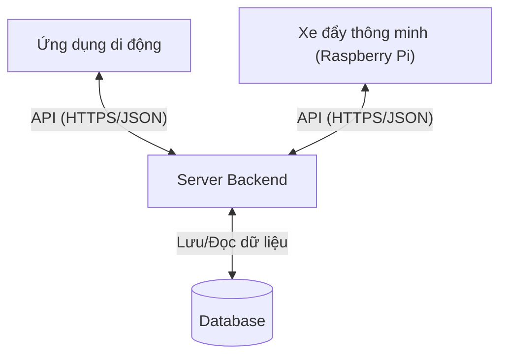
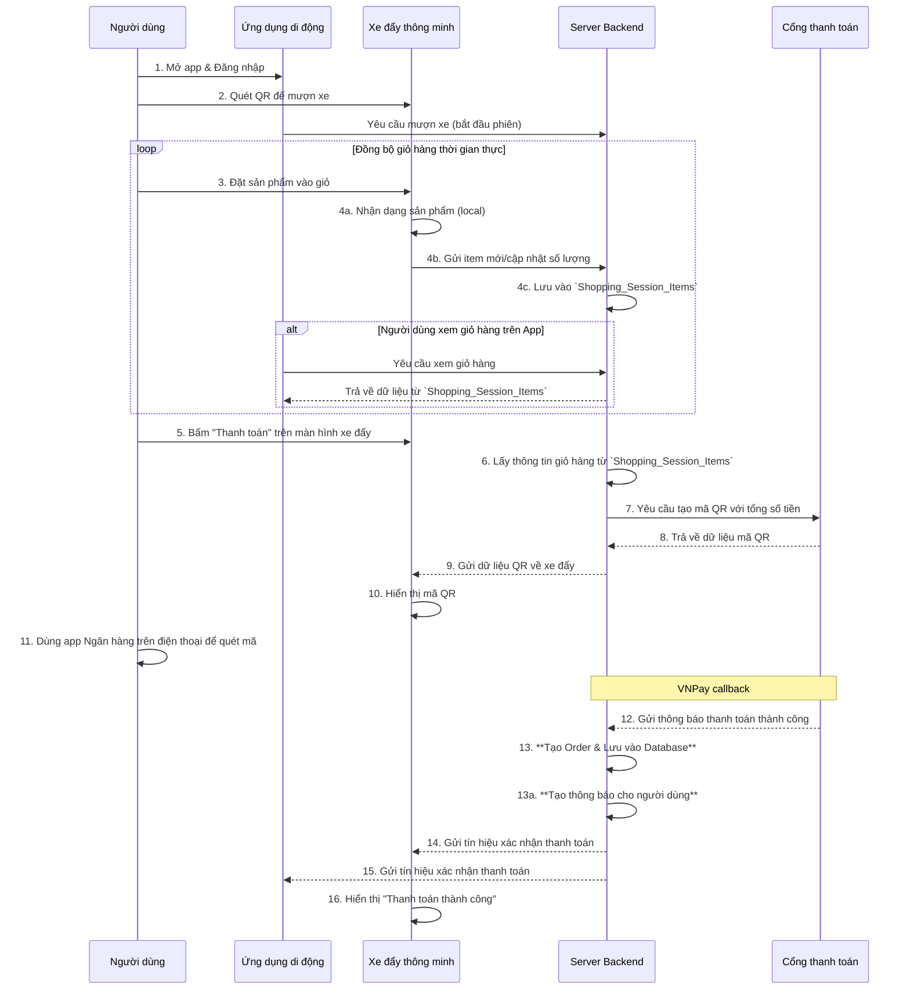

# Bản thảo kiến trúc hệ thống Giỏ hàng thông minh

## 1. Tổng quan

Hệ thống giỏ hàng thông minh (Smart Cart System) được thiết kế để cải thiện trải nghiệm mua sắm trong siêu thị, cho phép khách hàng sử dụng xe đẩy thông minh có khả năng nhận diện sản phẩm trực tiếp trên thiết bị, đồng bộ giỏ hàng theo thời gian thực và hỗ trợ thanh toán nhanh chóng.

---

## 2. Kiến trúc tổng thể

Hệ thống bao gồm ba thành phần chính, với kiến trúc nhận dạng sản phẩm **chạy trực tiếp trên xe đẩy (offline-first)**.

1. **Ứng dụng di động (Mobile App)**
   * **Đăng nhập, quét QR để mượn xe đẩy.**
   * Xem lại lịch sử các lần mua hàng trước đây.
   * **Thực hiện thanh toán online.**

2. **Xe đẩy thông minh (Smart Cart)**
   * **Phần cứng:** Raspberry Pi, màn hình cảm ứng, camera, cảm biến cân nặng.
   * **Phần mềm:**
     * Chạy model AI (Embedding Model) để trích xuất vector từ ảnh.
     * **Lưu trữ bản sao của Vector DB (Faiss index) cục bộ.**
     * **Lưu trữ bản sao dữ liệu các sản phẩm (tên, giá) để phục vụ hiển thị trên màn hình.**
     * **Tự thực hiện tìm kiếm vector để nhận dạng `productId`.**
     * Có cơ chế tự động tải về model AI, file Vector DB, và dữ liệu sản phẩm mới.

3. **Server Backend**
   * Quản lý người dùng, phiên đăng nhập, giỏ hàng, sản phẩm, khuyến mãi, đơn hàng, thông báo.
   * Lưu trữ và cung cấp file model AI và file Vector DB (Faiss index) cho xe đẩy tải về.
   * Cung cấp API để tải lên, tải xuống, liệt kê và xóa các mô hình AI.
   * Tích hợp cổng thanh toán, recommendation system, ...

---

## 3. Sơ đồ giao tiếp hệ thống

---

## 4. Luồng hoạt động chính (Main Activity Flow)

Sơ đồ dưới đây minh họa luồng tương tác đầy đủ, từ lúc mua sắm đến lúc thanh toán tại xe đẩy.

---

## 5. Kiến trúc triển khai (Deployment)

* **Raspberry Pi (Edge Device)**: chạy AI nhận diện + UI trên xe đẩy, tự động tải model mới, vector db mới từ server.
* **Server Backend (Cloud/On-premise)**: quản lý dữ liệu, lưu trữ model AI, thanh toán, và cung cấp các API cho quản lý AI models.
* **Database**: lưu trữ thông tin sản phẩm, giỏ hàng, người dùng, và metadata của các AI models.
* **Mobile App**: Android/iOS, kết nối với backend qua API.

---

## 6. Kết luận

Hệ thống giỏ hàng thông minh kết hợp giữa **Edge AI trên Raspi (có khả năng tự cập nhật model từ server)**, **Mobile App**, và **Server Backend** để mang lại trải nghiệm mua sắm liền mạch, hiện đại và tiện lợi cho khách hàng, đồng thời tối ưu quản lý vận hành cho siêu thị. Backend đóng vai trò trung tâm trong việc quản lý dữ liệu, xử lý nghiệp vụ, tích hợp thanh toán và cung cấp các API mạnh mẽ, bao gồm cả khả năng quản lý tập trung các mô hình AI.
